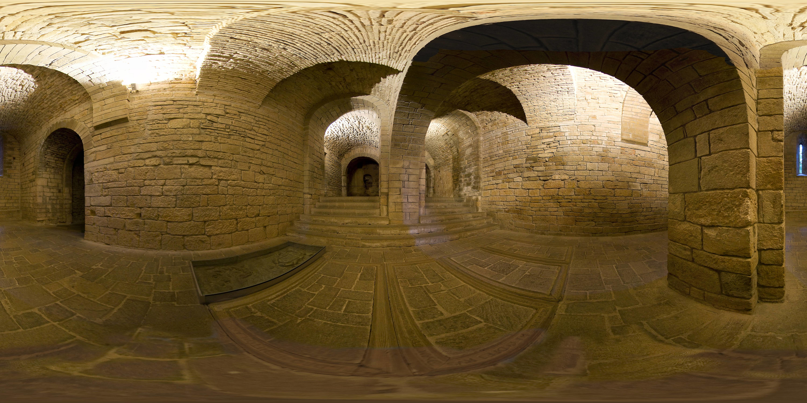
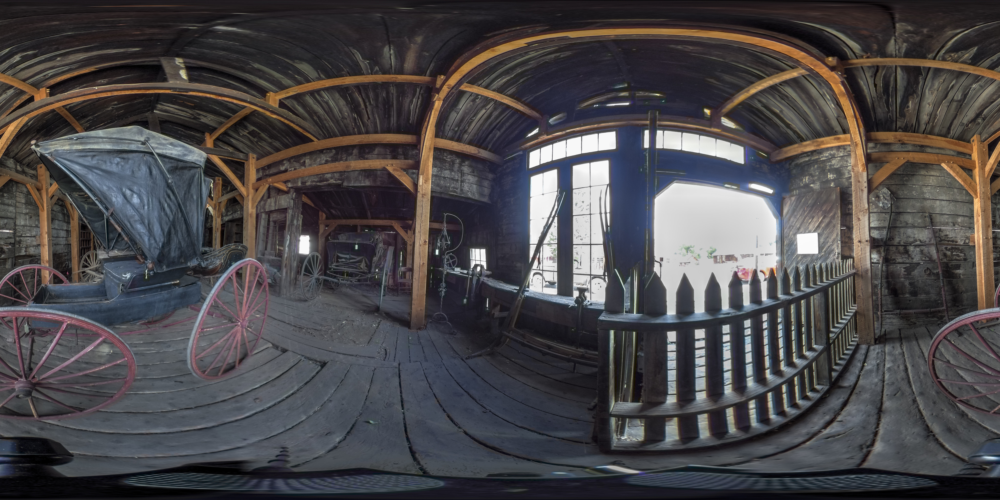
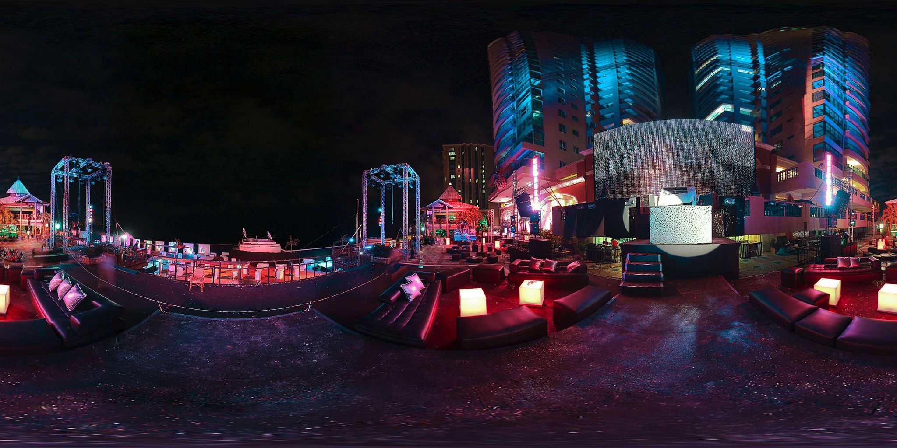
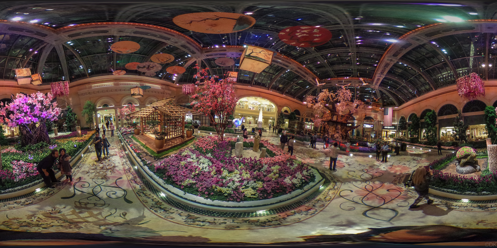
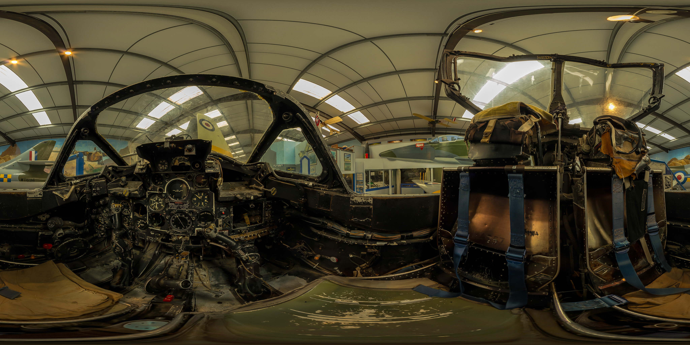
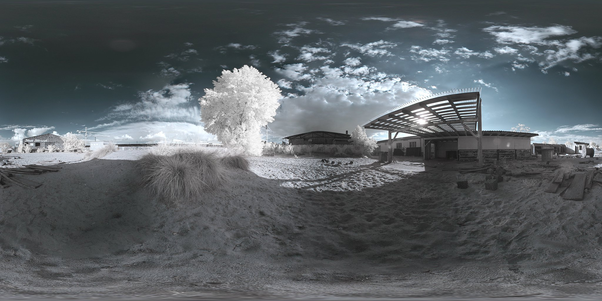
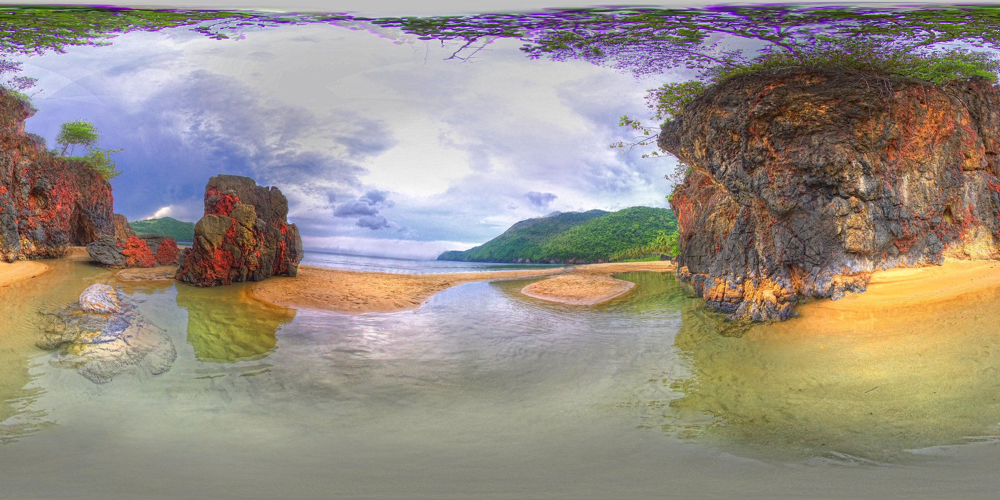
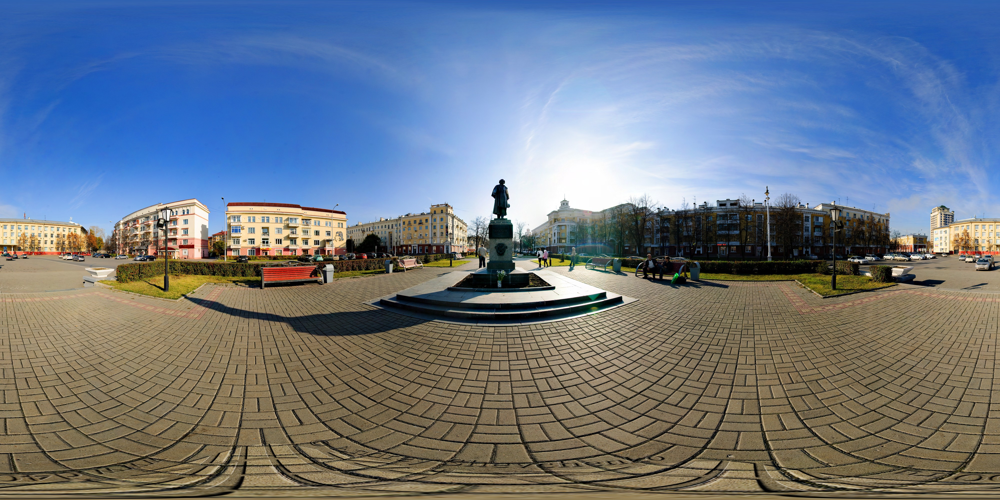
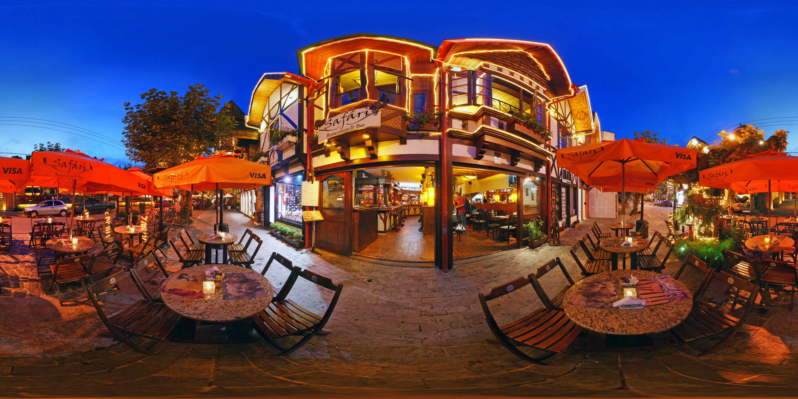

# 정성 평가 샘플 — QuIC-360 Panoramic Captioning

> **모델**: InternVL3.5-2B × 4 방법 (Resize / Native / +DenseCL / +VICReg-pw)  
> **Judge**: gpt-5.2, 이미지 포함, 100점 만점  
> **샘플**: 300개 테스트 풀에서 난이도별 10개 선별 (상 3 / 중 4 / 하 3)  
> **선별 기준**: 4모델 평균 점수 기준 계층적 샘플링 + 쿼리·이미지 다양성 확보

> **점수 산출**: Spatial(30%) + Query Relevance(25%) + Factual(20%) + Completeness(15%) + Fluency(10%), 각 1–5점 → 가중합 × 20 = 100점 만점

---

## 🔴 Hard — 모델이 어려워하는 케이스 (avg < 58)

### Sample 1 &nbsp; avg score: **35 / 100**

**Query**: `small objects`

**Reference**: in this small stones are arranged for looks good

| 방법 | 응답 | Judge | Spatial | Query | Factual | Complete | Fluency |
|:-----|:-----|:-----:|:-------:|:-----:|:-------:|:--------:|:-------:|
| **Resize** | There is a small statue of a man in a robe in the center of the room. | **33** | 1 | 2 | 1 | 1 | 5 |
| **Native** | There is a small rectangular object on the floor in the center of the room. It is made of glass and has a dark tint. | **44** | 2 | 3 | 1 | 1 | 5 |
| **+DenseCL** | There is a small rectangular metal box on the floor. It is square and has a flat top. | **31** | 1 | 2 | 1 | 1 | 4 |
| **+VICReg-pw** | There is a small rectangular metal box on the floor. It is square and has a flat top. | **31** | 1 | 2 | 1 | 1 | 4 |

> 💬 **Judge 코멘트** (Native): Despite fluent writing, it is inconsistent with the reference and likely incorrect for the scene.

### Sample 2 &nbsp; avg score: **51 / 100**

**Query**: `cars`

**Reference**: There is an extremely old car parked inside of the barn and a couple of modern vehicles parked outside.

| 방법 | 응답 | Judge | Spatial | Query | Factual | Complete | Fluency |
|:-----|:-----|:-----:|:-------:|:-----:|:-------:|:--------:|:-------:|
| **Resize** | There is a black carriage with a black canopy and pink wheels. | **38** | 2 | 1 | 2 | 1 | 5 |
| **Native** | There is a black car with a black top and pink wheels. It is parked in the middle of the room. | **66** | 3 | 4 | 3 | 2 | 5 |
| **+DenseCL** | There are two old style carriages with red wheels. They are parked inside a building. | **49** | 3 | 2 | 2 | 1 | 5 |
| **+VICReg-pw** | There are two old style carriages with red wheels. They are parked inside a building. | **52** | 3 | 2 | 2 | 2 | 5 |

> 💬 **Judge 코멘트** (Native): Relevant and fluent but only partially accurate and incomplete because it misses the outside vehicles and gives weak/possibly incorrect spatial placement.

### Sample 3 &nbsp; avg score: **55 / 100**

**Query**: `people`

**Reference**: There are some people seen, standing, sitting and talking. They're all enjoyed with heir choice activities.

| 방법 | 응답 | Judge | Spatial | Query | Factual | Complete | Fluency |
|:-----|:-----|:-----:|:-------:|:-----:|:-------:|:--------:|:-------:|
| **Resize** | There are people sitting on the deck of a boat. They are sitting on chairs and there are tables in front of them. | **50** | 1 | 4 | 2 | 2 | 5 |
| **Native** | There are people sitting on the chairs and tables. They are enjoying the night. | **59** | 2 | 4 | 2 | 3 | 5 |
| **+DenseCL** | There are people on the stage and on the balconies of the building. | **56** | 2 | 4 | 2 | 2 | 5 |
| **+VICReg-pw** | There are people on the stage and on the balconies of the building. | **56** | 2 | 4 | 2 | 2 | 5 |

> 💬 **Judge 코멘트** (Native): Relevant and fluent, but with weak visual grounding and limited panoramic/spatial correctness.

---

## 🟡 Medium — 중간 난이도 케이스 (avg 58–78)

### Sample 4 &nbsp; avg score: **58 / 100**

**Query**: `monuments`

**Reference**: There are several plant like monuments including one made of wood.

| 방법 | 응답 | Judge | Spatial | Query | Factual | Complete | Fluency |
|:-----|:-----|:-----:|:-------:|:-----:|:-------:|:--------:|:-------:|
| **Resize** | There is a small wooden structure that looks like a house with a roof. It is made of wood and has a small door. | **66** | 3 | 4 | 3 | 2 | 5 |
| **Native** | There is a small temple like structure in the middle of the mall. It is made of wood and has a roof. | **76** | 4 | 4 | 4 | 2 | 5 |
| **+DenseCL** | There is a large white monument in the middle of the mall. It is a tall, white, pointed monument. | **42** | 2 | 3 | 1 | 1 | 4 |
| **+VICReg-pw** | There is a large white monument in the middle of the mall. It is a tall, white, pointed monument. | **48** | 3 | 3 | 1 | 1 | 4 |

> 💬 **Judge 코멘트** (Native): A clear and mostly accurate description of one wooden monument-like structure, but it is incomplete relative to the reference which highlights multiple plant-like monuments.

### Sample 5 &nbsp; avg score: **64 / 100**

**Query**: `interior`

**Reference**: The inside of some old-timey vehicle is full of different buttons.

| 방법 | 응답 | Judge | Spatial | Query | Factual | Complete | Fluency |
|:-----|:-----|:-----:|:-------:|:-----:|:-------:|:--------:|:-------:|
| **Resize** | The interior of the plane is very old and worn. The seats are made of leather and the seats are very worn. | **57** | 3 | 4 | 2 | 1 | 4 |
| **Native** | The interior of the plane is very old and worn. The seats are worn and the plane is very old. | **70** | 4 | 4 | 3 | 2 | 4 |
| **+DenseCL** | The interior of the plane is very old and worn. The seats are old and worn. The seats are black and the seat belts are blue. | **64** | 3 | 4 | 3 | 2 | 4 |
| **+VICReg-pw** | The interior of the plane is very old and rusty. The seats are old and worn. | **66** | 3 | 4 | 3 | 2 | 5 |

> 💬 **Judge 코멘트** (Native): A generally plausible interior description that misses the reference’s main content about the many buttons and controls.

### Sample 6 &nbsp; avg score: **68 / 100**

**Query**: `building`

**Reference**: Three to four buildings stone and wooden buildings on site, lumber and stones scattered about in the yard, and large empty cable spools also in the yard. One building has an arbor that extends out in front of it.

| 방법 | 응답 | Judge | Spatial | Query | Factual | Complete | Fluency |
|:-----|:-----|:-----:|:-------:|:-----:|:-------:|:--------:|:-------:|
| **Resize** | There is a large building with a metal roof and a large open area in front of it. | **77** | 4 | 5 | 3 | 2 | 5 |
| **Native** | There is a building with a roof that is made of wood. It is a small building. | **66** | 3 | 4 | 3 | 2 | 5 |
| **+DenseCL** | There is a building with a roof that is made of wood. It is a large building. | **60** | 2 | 4 | 3 | 2 | 5 |
| **+VICReg-pw** | There is a building with a roof that is made of wood. It is a large building. | **71** | 3 | 5 | 3 | 2 | 5 |

> 💬 **Judge 코멘트** (Resize): Accurately notes the main building and foreground space but is too generic and misses several reference-specified site details.

### Sample 7 &nbsp; avg score: **73 / 100**

**Query**: `lake`

**Reference**: a clear lake with a green tall grass in the middle and a red building on the right

| 방법 | 응답 | Judge | Spatial | Query | Factual | Complete | Fluency |
|:-----|:-----|:-----:|:-------:|:-----:|:-------:|:--------:|:-------:|
| **Resize** | A lake is visible in the middle of the image. It is surrounded by trees and bushes. | **76** | 4 | 4 | 4 | 2 | 5 |
| **Native** | The lake is surrounded by trees and rocks. The water is calm and still. | **60** | 2 | 4 | 3 | 2 | 5 |
| **+DenseCL** | There is a lake in the middle of the forest. The lake is surrounded by trees and grass. | **75** | 3 | 5 | 4 | 2 | 5 |
| **+VICReg-pw** | There is a lake in the middle of the forest. The lake is surrounded by trees and grass. | **81** | 4 | 5 | 4 | 2 | 5 |

> 💬 **Judge 코멘트** (+VICReg-pw): Relevant and mostly accurate but lacks the distinctive objects and details from the reference.

---

## 🟢 Easy — 모델이 잘 처리하는 케이스 (avg ≥ 78)

### Sample 8 &nbsp; avg score: **78 / 100**

**Query**: `landscape`

**Reference**: This is taken on a sandy beach with a few large rocks in the foreground and it is surrounded by green hills covered with thick trees.

| 방법 | 응답 | Judge | Spatial | Query | Factual | Complete | Fluency |
|:-----|:-----|:-----:|:-------:|:-----:|:-------:|:--------:|:-------:|
| **Resize** | The landscape is a beach with a large rock formation on the side of the beach. | **78** | 3 | 5 | 4 | 3 | 5 |
| **Native** | The landscape is a beach with a rocky cliff on one side and a mountain on the other. | **84** | 4 | 5 | 4 | 3 | 5 |
| **+DenseCL** | The landscape is a beach with a large rock formation in the middle of the beach. | **75** | 3 | 5 | 4 | 2 | 5 |
| **+VICReg-pw** | The landscape is a beach with a large rock formation in the middle of the beach. | **75** | 3 | 5 | 4 | 2 | 5 |

> 💬 **Judge 코멘트** (Native): Overall it is a fluent and mostly accurate landscape description, but it lacks several specific elements from the reference and is spatially nonspecific.

### Sample 9 &nbsp; avg score: **81 / 100**

**Query**: `monuments`

**Reference**: There is a very large monument in the center of the square it has a man on top wearing a Cape.

| 방법 | 응답 | Judge | Spatial | Query | Factual | Complete | Fluency |
|:-----|:-----|:-----:|:-------:|:-----:|:-------:|:--------:|:-------:|
| **Resize** | There is a statue of a man in a hat and a coat. He is holding a book. | **67** | 3 | 5 | 2 | 2 | 5 |
| **Native** | There is a statue of a man on a pedestal in the middle of a plaza. | **88** | 4 | 5 | 5 | 3 | 5 |
| **+DenseCL** | There is a monument in the middle of the park. It is a statue of a man. | **84** | 4 | 5 | 4 | 3 | 5 |
| **+VICReg-pw** | There is a monument in the middle of the park. It is a statue of a man. | **84** | 4 | 5 | 4 | 3 | 5 |

> 💬 **Judge 코멘트** (Native): A relevant and accurate caption focused on the monument, but it misses notable descriptive details present in the reference.

### Sample 10 &nbsp; avg score: **84 / 100**

**Query**: `cars`

**Reference**: There are some cars parked which must belong to people within this environment.

| 방법 | 응답 | Judge | Spatial | Query | Factual | Complete | Fluency |
|:-----|:-----|:-----:|:-------:|:-----:|:-------:|:--------:|:-------:|
| **Resize** | There are cars parked in the parking lot in front of the restaurant. | **77** | 3 | 5 | 3 | 4 | 5 |
| **Native** | There are a few cars parked on the side of the street. They are parked in a line. | **87** | 4 | 5 | 4 | 4 | 5 |
| **+DenseCL** | There are several cars parked on the street. They are parked in front of the restaurant. | **87** | 4 | 5 | 4 | 4 | 5 |
| **+VICReg-pw** | There are several cars parked on the street. They are parked in front of the restaurant. | **87** | 4 | 5 | 4 | 4 | 5 |

> 💬 **Judge 코멘트** (Native): A relevant and mostly accurate description of the parked cars with good spatial grounding.

---

## 📊 종합 분석

### 샘플별 요약

| # | 난이도 | Query | Avg Score | Resize | Native | +DenseCL | +VICReg-pw |
|:-:|:------:|:------|:---------:|:------:|:------:|:--------:|:----------:|
| 1 | 🔴 | `small objects` | **35** | 33 | 44 | 31 | 31 |
| 2 | 🔴 | `cars` | **51** | 38 | 66 | 49 | 52 |
| 3 | 🔴 | `people` | **55** | 50 | 59 | 56 | 56 |
| 4 | 🟡 | `monuments` | **58** | 66 | 76 | 42 | 48 |
| 5 | 🟡 | `interior` | **64** | 57 | 70 | 64 | 66 |
| 6 | 🟡 | `building` | **68** | 77 | 66 | 60 | 71 |
| 7 | 🟡 | `lake` | **73** | 76 | 60 | 75 | 81 |
| 8 | 🟢 | `landscape` | **78** | 78 | 84 | 75 | 75 |
| 9 | 🟢 | `monuments` | **81** | 67 | 88 | 84 | 84 |
| 10 | 🟢 | `cars` | **84** | 77 | 87 | 87 | 87 |

### 방법별 평균 (선별 샘플 기준)

| 방법 | Avg Score | Spatial | Query | Factual | Complete | Fluency |
|:-----|:---------:|:-------:|:-----:|:-------:|:--------:|:-------:|
| **Resize** | **61.9** | 2.7 | 3.9 | 2.6 | 2.0 | 4.9 |
| **Native** | **70.0** | 3.2 | 4.2 | 3.2 | 2.4 | 4.9 |
| **+DenseCL** | **62.3** | 2.7 | 3.9 | 2.8 | 2.0 | 4.7 |
| **+VICReg-pw** | **65.1** | 3.0 | 4.0 | 2.8 | 2.1 | 4.8 |

### 주요 관찰

1. **Hard 케이스 공통 패턴**: 추상적 쿼리(`small objects`, `what they are doing`)에서 모델이 reference와 동떨어진 hallucination을 생성하는 경향. Spatial/Factual 점수가 특히 낮음.
2. **Medium 케이스**: 쿼리 관련성(Query Relevance)은 높으나, reference의 구체적 디테일을 놓치는 경향. Completeness 점수가 병목.
3. **Easy 케이스**: 시각적으로 명확한 장면(`weather`, `building`, `location`)에서 4개 방법 모두 높은 점수. 방법 간 차이 미미.
4. **방법 간 비교**: Native/+DenseCL/+VICReg-pw가 Resize 대비 Medium 난이도에서 차별화되는 경향. Hard에서는 모든 방법이 고전.
